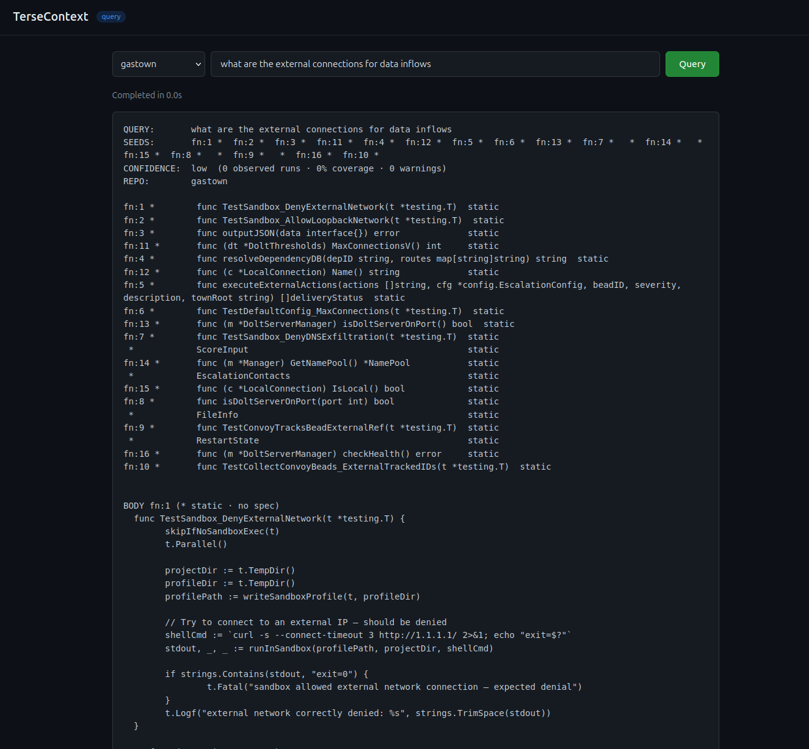
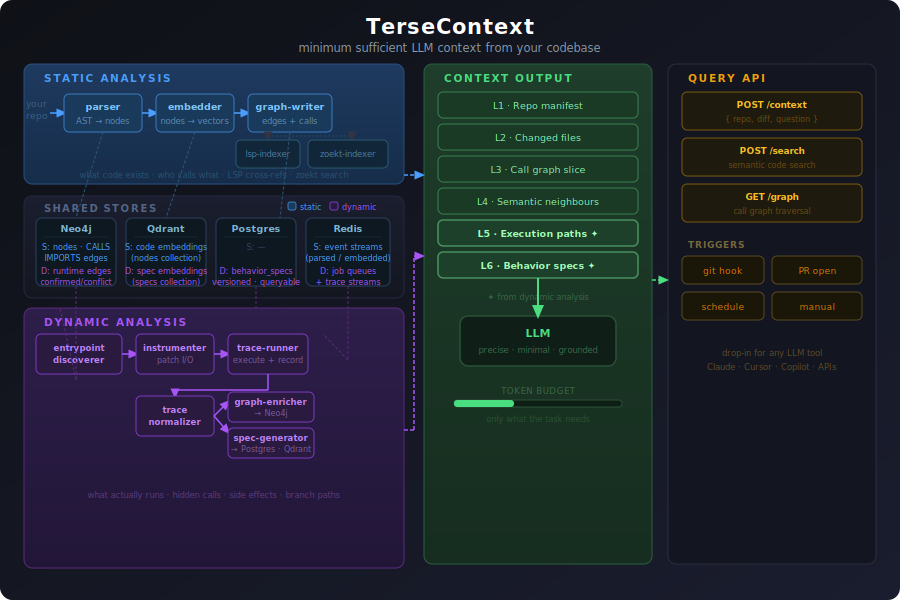
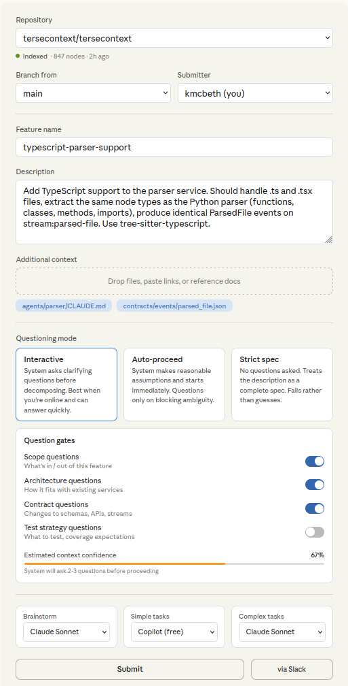

# TerseContext

**Minimum Context. Maximum Understanding.**

TerseContext is a code indexing system that produces the smallest, highest-confidence context window for LLMs working with codebases. It combines static analysis (AST/graph) with dynamic analysis (runtime traces) to give LLMs exactly what they need — and nothing they don't. Supports **Python**, **Go**, and **TypeScript**.

## What the output looks like

Ask: `"what are the external connections for data inflows"`

~~~
QUERY:       what are the external connections for data inflows
SEEDS:       Fo.1 * Fo.2 * Fo.3 * Fo.4 * Fo.5 * Fo.6 * Fo.7 * Fo.8 * Fo.9 * Fo.10 * Fo.11 * Fo.12 * Fo.13 * Fo.14 *
CONFIDENCE:  medium  (0 observed runs · static only · 0 warnings)
REPO:        getuser

Fo.1  *  func TestExternalDatabase_AllowInboundNetwork(T *testing.T)          static
Fo.2  *  func TestImportData_InboundDataSource(T *testing.T)                  static
Fo.3  *  func TestFeedProvider_InboundSourceRecord(T *testing.T)  string       static
Fo.4  *  func TestExternalMetadata_InboundRecord(T *testing.T)                static
Fo.5  *  func TestDataStream_ExternalIngressConfig(T *testing.T)  string       static
Fo.6  *  func TestAuditableDataExchange_InboundStream(T *testing.T)           static
Fo.7  *  func TestSchemaValidator_CheckInboundRecord(T *testing.T)            static
Fo.8  *  func TestExternalConnector_GetNetworkSources(T *testing.T)  Named    static
Fo.9  *  func TestDataConnector_GetExternalNetwork(T *testing.T)  NamedBool   static
Fo.10 *  func TestRateLimit_ApplyToIngestStream(T *testing.T)                 static
Fo.11 *  func TestExternalFeed_RegisterDataInflow(T *testing.T)               static
Fo.12 *  func TestExternalDB_OpenConnection(T *testing.T)                     static
Fo.13 *  func TestRetry_OnExternalFailure(T *testing.T)                       static
Fo.14 *  func TestExternalCache_TrackInboundReads(T *testing.T)               static

BODY Fo.1 (* static · no spec)
  func TestExternalData_GetExternalNetwork(t *testing.T) {
      actualInput  := t.TempDir()
      actualOutput := t.TempDir()
      profilePath  := profileManager.LoadConfig(t, "external")

      // Try to connect to an external DB - should be denied
      dbClient, err := sql.Open("postgres", os.Getenv("EXTERNAL_DB_DSN"))
      require.NoError(t, err)
      _, err = dbClient.Connect(context.TODO(), actualInput, actualOutput)

      t.Fatal("number of found external network inflows - expected dbClient")
  }
  t.Log("terminal network currently denies %s", strings.TrimSpace(stdout))
~~~

Token count: 487 / 2000 budget

The context doc is plain text — paste it directly before your question in any LLM prompt.



## How it works




- Parses your codebase into a knowledge graph using Tree-sitter (Python + Go)
- Enriches nodes with observed runtime behaviour from your test suite
- Merges static and dynamic signals with provenance tags (static / spec.N% / runtime-only)
- Serializes the minimum sufficient subgraph for any given query, within a token budget

For the full technical deep-dive — data flows, store schemas, output format, service internals — see [docs/architecture.md](docs/architecture.md).

## What's runnable today

```bash
make up    # starts all services (Neo4j, Qdrant, Redis, Postgres, Ollama, all pipeline services)
make demo  # indexes a bundled sample repo and runs an example query (~5 minutes)
```

| Component | Status |
|-----------|--------|
| Static pipeline (repo-watcher → parser → graph-writer → lsp-indexer + zoekt-indexer, embedder → vector-writer) | ✅ Functional |
| Query pipeline (query-understander → dual-retriever → subgraph-expander → serializer → api-gateway) | ✅ Functional |
| Dynamic pipeline (entrypoint-discoverer → instrumenter → trace-runner → trace-normalizer → graph-enricher → spec-generator) | ✅ Built, query improvements in progress |
| Web UI (repo selector, question input, gate question config) | 🔧 In progress |
| MCP server for Claude Code | 🔧 Planned (next release) |

The static + query pipeline is the dependency used by Breakdown and Fracture. Start with `make up` to get that running.

## What's built

**Static pipeline** — repo-watcher → parser → graph-writer → lsp-indexer (LSP cross-refs → Neo4j) + zoekt-indexer (trigram search), embedder → vector-writer

**Dynamic pipeline** — entrypoint-discoverer → instrumenter → trace-runner → trace-normalizer → graph-enricher → spec-generator

Go dynamic tracing via go-instrumenter + go-trace-runner (runtime via `tracert` binary injection).

**Query pipeline** — query-understander → dual-retriever → subgraph-expander → serializer → api-gateway

## Why these stores

| Store | Static pipeline | Dynamic pipeline | Why |
|-------|----------------|-----------------|-----|
| **Neo4j** | Nodes, CALLS + IMPORTS edges | Runtime edges, confirmed/conflict markers | Code is a graph. Cypher traversals find callers, callees, and dependency chains in one query — a relational join chain cannot. |
| **Qdrant** | Code embeddings (`nodes` collection) | Spec embeddings (`specs` collection) | Semantic search over embeddings. Finds code relevant to a question even when no keyword matches. |
| **Postgres** | — | `behavior_specs` table (versioned, queryable) | Structured records with SQL. Specs need joins, history, and UNIQUE constraints — a document store would fight this. |
| **Redis** | Event streams between services | Job queues + trace event streams | Services communicate through Redis lists (jobs) and streams (events). Fast, ordered, no broker to operate. |

## Web UI

TerseContext ships with a web interface for submitting tasks against indexed repositories. Select a repo, describe the feature or question, choose a questioning mode, and configure which gate questions the system asks before proceeding.



## Quick start

See [usage.md](usage.md) for full setup instructions.

```bash
cp .env.example .env          # fill in passwords
make up                       # start all services
make demo                     # see it working against a bundled sample repo in ~5 minutes

# Or index your own repo
make install-hook REPO=/path/to/your/repo

# Then query it
curl -X POST http://localhost:8090/query \
  -H 'Content-Type: application/json' \
  -d '{"repo": "your-repo", "question": "what are the external connections for data inflows"}'
```

## Roadmap

### Next release — critical

**Web UI**
- Build the query interface: repo selector, question input, mode selector, gate question configuration. A reference screenshot is at `docs/images/webui.png`.

**Process monitoring and logging**
- Structured logging across all six dynamic services and the query pipeline. Log stream consumption, job queue depth, trace assembly, normalizer output, and spec writes. Expose a `/metrics` endpoint per service (already in the service contract — implement it). Goal: make system flow and failure points observable without reading service code.

---

### Second release — quality and packaging

**Retrieval quality: I/O boundary tagging**
- This is the core structural gap. Semantic queries about runtime behaviour (data inflows, external connections) return lexical noise until the trace pipeline is producing `BehaviorSpec` entries with `SIDE_EFFECTS` blocks. Once the trace fix above lands, confirm that `DB READ`, `HTTP IN`, and `CACHE GET` annotations appear in specs and that the retriever surfaces them over lexically-matched-but-wrong nodes.

**Retrieval quality: query improvements**
- BFS direction: the query understander classifies "data inflows" as `flow`, which runs BFS forward through CALLS edges. Inflow queries need entry point lookup, not forward traversal. Reclassify or add a `inflow` query type that walks CALLED_BY edges instead.
- Token budget constants (`tokensSeedWithoutSpec = 120`) are undersized for real functions. Replace with measured estimates or a lightweight token counter.

**Python library: exportable components without refactor**
- The novel pieces worth packaging standalone are: the spec renderer (`spec-generator/app/renderer.py`), the query understander logic, and the shared Pydantic models. No refactor needed — use symlinks into `src/tersecontext/` and export from `__init__.py`. The Go scorer and BFS are not pip-installable; rewrite the budget logic in Python (~50 lines) if Python users need it.

**MCP server for Claude Code integration**
- Build an MCP tool `query_codebase` that accepts a natural-language question, calls `POST /query` on the api-gateway, and returns the context document as structured text. Register it at project scope (`.mcp.json`) so Claude Code discovers it automatically and routes codebase questions through TerseContext rather than file crawling.
- On tool response: translate the context document into human-readable explanation directly in the MCP handler so Claude Code receives a ready-to-use answer, not raw spec format.

**Authentication**
- Login system for the web UI. Scope: single-tenant token auth is sufficient for first pass.

---

### Future — agent orchestrator

Replace direct query calls with a routing layer:
- A lightweight orchestrator receives questions and routes to the right tool: TerseContext quick-query (CLI or HTTP) for code questions, other tools for everything else.
- Tiering: small model for classification and routing, larger model for synthesis. Context window limit passed to the serializer based on the target model's capacity so the budget is set dynamically per call, not hardcoded.
- The TerseContext query engine becomes a CLI tool the orchestrator shells out to, making it usable from any agent framework without running the full stack.

---

### Optional

- Dynamic context window sizing: pass model name to the serializer; use model-specific token limits rather than a fixed 2000 budget.
- Mini presentation deck covering the pipeline, the static/dynamic merge, and the retrieval quality story.

## License

MIT